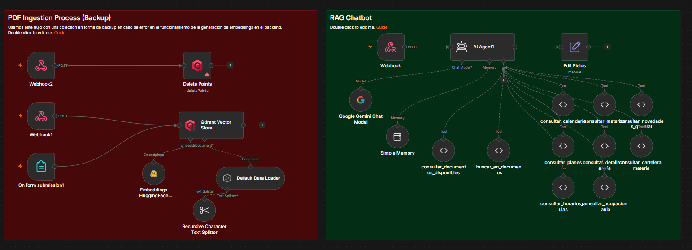

# Chatbot Académico - Facultad de Informática UNLP

Asistente conversacional para estudiantes de la Facultad de Informática de la UNLP. Responde consultas sobre materias, horarios, correlativas, planes de estudio y documentos académicos vía WhatsApp.

## Arquitectura

```
WhatsApp → n8n (agente IA + tools) →   Flask Backend  → Qdrant (búsqueda semántica)
                                      ↓             ↓
                          APIs públicas UNLP   Documentos Academicos(Qdrant vectors)
```

- **n8n**: orquesta el agente de IA (Groq/Gemini) y las herramientas
- **Flask**: backend que procesa PDFs, genera embeddings y expone la API de búsqueda
- **Qdrant**: base de datos vectorial para búsqueda semántica en documentos
- **HuggingFace**: modelo `intfloat/multilingual-e5-large` para embeddings

---

## Estructura del proyecto

```
TTPS-chatbot/
  backend-flask/        ← código Flask
    src/
    app.py
    Dockerfile
    pyproject.toml
    poetry.lock
  n8n/
    data/               ← datos de n8n (generado al correr)
    qdrant_data/        ← datos de qdrant (generado al correr)
    workflows/          ← workflows exportados para importar en n8n
  docker-compose.yml    ← levanta todo el proyecto
  .env                  ← variables de entorno (no incluido en el repo)
  .env.example          ← plantilla de variables de entorno
```

---

## Requisitos

- [Docker](https://www.docker.com/products/docker-desktop) y Docker Compose
- Cuenta en [HuggingFace](https://huggingface.co/) (opcional, hay fallback local pero es más lento)
- Cuenta en [Groq](https://console.groq.com/) o [Google Gemini](https://aistudio.google.com/api-keys) para el modelo de IA
- WhatsApp Business Integration (Ver [guía detallada](backend-flask/WhatsappInt.md))

---

## Instalación con Docker (recomendado)

### 1. Clonar el repositorio

```bash
git clone <repo-url>
cd TTPS-chatbot
```

### 2. Configurar variables de entorno

Copiá el archivo de ejemplo y completá los valores:

```bash
cp .env.example .env
```

Editá el `.env` con tus credenciales:

```env
HUGGINGFACE_API_TOKEN=hf_xxxxxxxxxxxx   # Opcional, acelera los embeddings
SECRET_KEY=una-clave-secreta-cualquiera
DB_USER=postgres
DB_PASSWORD=postgres
DB_NAME=chatbot_db
WHATSAPP_TOKEN=tu_token_de_meta
PHONE_NUMBER_ID=tu_phone_id
```

### 3. Levantar todos los servicios

```bash
docker compose up --build
```

La primera vez tarda unos minutos porque construye la imagen de Flask e instala las dependencias. Cuando veas estos mensajes todo está corriendo:

```
flask  | * Running on http://0.0.0.0:5000
n8n    | Editor is now accessible via: http://localhost:5678
qdrant | Qdrant gRPC listening on 6334
```

Verificá que los servicios estén activos:

- **Flask** → http://localhost:5000
- **N8n** → http://localhost:5678 
- **Qdrant** → http://localhost:6333/dashboard

## Screenshots 




---

## Configurar n8n

### 1. Importar el workflow

1. Abrí http://localhost:5678
2. Iniciá sesión con tus credenciales personales
3. En el menú: **Workflows → Import from file**
4. Seleccioná el archivo `chatbot_unlp_v8.2json`(ultima version) de la carpeta `n8n/workflows/`

### 2. Configurar credenciales

Dentro del workflow configurá una de estas opciones como modelo de IA:

- **Google Gemini API**: tu API key de Google AI Studio . Podes obtenerla aca: https://aistudio.google.com/api-keys
- **Groq API**: tu API key de Groq (modelo `llama-3.3-70b-versatile`)

### 3. Verificar las URLs de los tools

Los tools `buscar_en_documentos` y `consultar_documentos_disponibles` ya apuntan al servicio Flask por nombre de contenedor. Verificá que las URLs sean:

```javascript
url: "http://flask:5000/document/api/search";
url: "http://flask:5000/document/api/list";
```

> Dentro de Docker los servicios se comunican por nombre (`flask`, `qdrant`, `n8n`) en lugar de por IP.

### 4. Activar el workflow

Hacé click en el toggle de arriba a la derecha del workflow para activarlo.

---

## Cargar documentos académicos

1. Abrí http://localhost:5000 en el navegador
2. Iniciá sesión con tu usuario
3. Ir a **Documentos → Nuevo documento**
4. Subí un PDF (programa de materia, reglamento, plan de estudios, etc.)
5. El sistema automáticamente:
   - Divide el PDF en chunks por secciones
   - Genera embeddings con `multilingual-e5-large` usando el prefijo `passage: `
   - Indexa los vectores en Qdrant

> **Importante**: si ya tenías documentos cargados de una versión anterior, eliminalos y volvelos a subir. Los embeddings viejos pueden ser incompatibles.

---

## Cómo funciona la búsqueda semántica

El modelo `multilingual-e5-large` requiere prefijos específicos para funcionar correctamente:

| Uso                   | Prefijo     |
| --------------------- | ----------- |
| Indexar documentos    | `passage: ` |
| Consultas de búsqueda | `query: `   |

Sin estos prefijos los vectores son incompatibles entre sí y la búsqueda devuelve resultados irrelevantes.

---

## Herramientas disponibles en el agente

| Tool                               | Descripción                                           |
| ---------------------------------- | ----------------------------------------------------- |
| `consultar_materias`               | Busca materias por nombre y devuelve su slug          |
| `consultar_detalle_materia`        | Horarios, inicio de cursada y programa de una materia |
| `consultar_horarios_aulas`         | Días, horarios y aulas asignadas                      |
| `consultar_cartelera_materia`      | Novedades, fechas de finales e inscripciones          |
| `consultar_calendario`             | Calendario académico oficial                          |
| `consultar_planes`                 | Planes de estudio y correlativas por carrera          |
| `consultar_novedades_general`      | Noticias generales de la facultad                     |
| `consultar_ocupacion_aula`         | Disponibilidad de un aula específica                  |
| `buscar_en_documentos`             | Búsqueda semántica en PDFs cargados                   |
| `consultar_documentos_disponibles` | Lista los PDFs indexados con sus IDs                  |

---

## Comandos útiles

```bash
# Levantar todo
docker compose up

# Levantar en segundo plano
docker compose up -d

# Resetear la base de datos de Flask / PostgreSQL
docker compose exec flask flask --app app.py reset-db

# Ver logs de un servicio específico
docker compose logs flask
docker compose logs n8n
docker compose logs qdrant

# Parar todos los servicios
docker compose down

# Reconstruir la imagen de Flask (después de cambios en el código)
docker compose up --build flask
```

---

## 🌐 Desarrollo Local con Ngrok

Para testear el webhook de WhatsApp en desarrollo local, necesitás exponerdirectamente tu servidor Flask a través de Ngrok.

### Instalación de Ngrok

1. Descargá ngrok desde [ngrok.com](https://ngrok.com/download)
2. Descompactá el archivo
3. Agregalo a tu PATH (o usalo desde el directorio donde lo descargaste)

### Uso en Desarrollo

**Terminal 1 - Levantá los servicios Docker:**

```bash
docker compose up
```

**Terminal 2 - Exponé Flask con Ngrok:**

```bash
ngrok http 5000
```

Deberías ver algo como:

```
ngrok                                                              (Ctrl+C to quit)

Session Status                online
Account                       tu-cuenta@gmail.com (Plan: Free)
Version                        3.5.0
Region                        us (United States)
Forwarding                    https://abc123def456.ngrok.io -> http://localhost:5000
Forwarding                    http://abc123def456.ngrok.io -> http://localhost:5000

Connections                   ttl opn rt1 rt5 p95
                              0   0   0.00 0.00 0.00
```

### Configurar en Meta Developer

1. Copiar la URL de ngrok: `https://abc123def456.ngrok.io`
2. Ir a [developers.facebook.com](https://developers.facebook.com)
3. En tu app → **WhatsApp → Configuration**
4. En **Webhook**:
   - **Callback URL**: `https://abc123def456.ngrok.io/webhook`
   - **Verify Token**: El mismo que en tu `.env` (`WEBHOOK_VERIFY_TOKEN`)

### Testear el Webhook

```bash
# Verificar que el webhook responde
curl -X GET "https://abc123def456.ngrok.io/webhook?hub.mode=subscribe&hub.challenge=test123&hub.verify_token=TU_TOKEN"
```

Si ves una respuesta `200 OK`, el webhook está correctamente configurado.

### Notas Importantes

- La URL de ngrok **cambia cada 2 horas** con el plan gratuito. Si se desconecta, necesitarás actualizar la URL en Meta Developer.
- Ngrok registra todas las peticiones en `http://localhost:4040` para debugging.
- Para producción, usa un dominio real (sin ngrok) con certificate HTTPS válido.

---

## 📱 Integración WhatsApp Business

Para configurar y mantener la integración con WhatsApp Business API, consultá la [guía completa de WhatsApp Integration](backend-flask/WhatsappIntegration.md).

Esta guía incluye:

- Configuración paso a paso del webhook en Meta Developer
- Agregar números de prueba
- Tipos de tokens y sus usos
- Flujo de mensajes y arquitectura
- Solución de problemas y códigos de error
- Deployment en desarrollo y producción

---

## Solución de problemas frecuentes

**Flask no conecta con Qdrant**
→ Verificá que `QDRANT_URL=http://qdrant:6333` esté en el `docker-compose.yml`. Dentro de Docker no usar `localhost`.

**N8n no conecta con Flask**
→ Las URLs de los tools deben usar `http://flask:5000`, no `localhost` ni la IP de la máquina.

**Error `SQLITE_CORRUPT` en n8n**
→ La base de datos de n8n se corrompió. Borrá el archivo y reiniciá:

```bash
rm n8n/data/database.sqlite
docker compose up
```

Luego reimportá el workflow desde `n8n/workflows/`.

**Resultados de búsqueda duplicados**
→ El documento fue indexado más de una vez. Eliminalo desde el panel de Flask y volvelo a subir.

**Resultados poco relevantes en la búsqueda**
→ Los documentos fueron indexados sin los prefijos correctos. Eliminá todos los documentos y volvelos a cargar con la versión actual del backend.

**El token de WhatsApp expiró**
→ Entrá a [developers.facebook.com](https://developers.facebook.com), regenerá el token y actualizá `WHATSAPP_TOKEN` en el `.env`. Reiniciá Flask con `docker compose up flask`.
